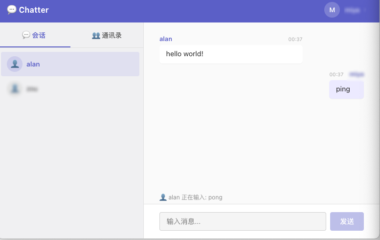

# Chatter — 即时通讯 Demo

一个基于 WebSocket 的实时聊天应用 Demo，支持一对一私聊、实时消息推送、在线状态与正在输入提示等功能。



---

## 技术栈

### 前端

| 技术 | 用途 |
|------|------|
| **React 19** + React Router 7 | UI 框架与路由 |
| **Zustand** | 状态管理（Store 按业务拆分） |
| **Socket.IO Client** | WebSocket 实时通信 |
| **Vite** | 构建工具 |

### 后端

| 技术 | 用途 |
|------|------|
| **Express** | HTTP 服务框架 |
| **Socket.IO** | WebSocket 实时通信 |
| **SQLite** | 嵌入式数据库 |
| **Drizzle ORM** | 数据库 ORM |
| **JWT** | 用户认证 |
| **bcrypt** | 密码加密 |

---

## 功能特性

- **用户注册与登录** — 用户名 + 密码，密码经 bcrypt 加密，JWT 鉴权
- **一对一私聊** — 输入用户 ID 发起会话，自动创建或复用已有会话
- **实时消息** — 基于 Socket.IO 的即时消息推送
- **在线状态** — 用户上线/下线实时通知
- **正在输入提示** — 实时展示对方正在输入的内容
- **未读消息** — 会话列表显示未读数量
- **增量消息拉取** — 支持基于消息 ID 的增量同步
- **用户列表** — 查看所有注册用户及其在线状态

---

## 快速开始

### 前置要求

- Node.js >= 18
- npm

### 1. 安装依赖

```bash
# 安装服务器依赖
cd server
npm install

# 安装客户端依赖
cd ../client
npm install
```

### 2. 初始化数据库

```bash
cd ../server
npm run dev
```

首次启动会自动创建 SQLite 数据库文件 `data/chatter.db`。

### 3. 启动开发服务器

**终端 1 — 启动后端服务（端口 3000）：**

```bash
cd server
npm run dev
```

**终端 2 — 启动前端开发服务器（端口 5173）：**

```bash
cd client
npm run dev
```

### 4. 打开应用

浏览器访问 `http://localhost:5173`。

## 许可证

MIT
